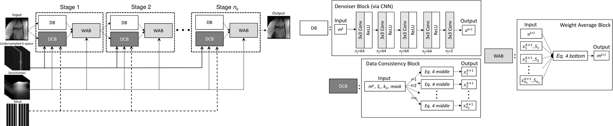
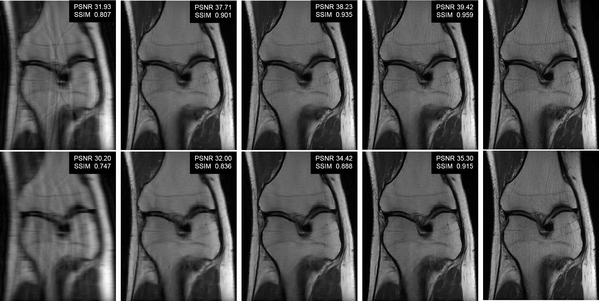

# VS-Net: Variable splitting network for accelerated parallel MRI reconstruction 

The code in this repository implements VS-Net (Fig.1), a model-driven neural network for accelerated parallel MRI reconstruction. Specifically, we formulate the generalized parallel compressed sensing reconstruction as an energy minimization problem, for which a variable splitting optimization method is derived. Based on this formulation we propose a novel, end-to-end trainable deep neural network architecture by unrolling the resulting iterative process of such variable splitting scheme. We evaluated VS-Net on complex valued multi-coil knee images for 4-fold and 6-fold acceleration factors (Fig.2).


 
:--:
*Fig.1: VS-Net overall architecture (left) and each block in VS-net (right). DB, DCB and WAB stand for Denoiser Block, Data Consistency Block and Weighted Average Block, respectively.* 


:--:
*Fig.2: Visual comparison using Cartesian undersampling with AF 4 (top) and 6 (bottom). From left to right: zero-filling, l1-SPIRiT, Variational Network, VS-Net and ground truth. Click [here](http://www.cs.bham.ac.uk/~duanj/moive/more_visual_comparison.pdf) for more visual comparison.*

## 1. Overview
The files in this repository are organized into 5 directories and 1 root directory:
* root : contains base functions for training, validation, inference and visualizaiton:
  * network architecture, as shown in Fig.1 - [architecture.py](architecture.py)
  * data loader to read complex-valued raw MRI data and sensitivity maps - [data_loader.py](data_loader.py)
  * inference to deploy a trained model on unseen raw data - [inference.py](inference.py)
  * save png images for visualization after inference - [save_png.py](save_png.py)
  * train and validate the VS-Net - [vs_net.py](vs_net.py)
* [common](common) : contains dependant functions used in training or deploying VS-Net and is written by [fastMRI](https://github.com/facebookresearch/fastMRI) with some of my modificatins
* [data](data) : contains dependant functions used in training or deploying VS-Net and is writen by [fastMRI](https://github.com/facebookresearch/fastMRI)
* [log](log) : produces `csv` files where the quantitative metrics (PSNR, SSIM and NMSE) over iterations are saved
* [model](model) : saves trained models. There are 4 pre-trained models that can be used directly to see VS-Net performance.
* [results](results) : save final results. After inference is run, this folder will produce 3 mat files, i.e. vs-200.mat, zero_filling.mat and reference.mat. On top of the three mat files, running [save_png.py](save_png.py) will produce png files.


## 2. run VS-Net
To start the training process with [vs_net.py](vs_net.py), please follow the following steps: 

### Download the knee data
1 Download all data that we used for our experiments at [GLOBUS](https://app.globus.org/file-manager?origin_id=15c7de28-a76b-11e9-821c-02b7a92d8e58&origin_path=%2F).

### Install python libraries
```
pip install visdom torch==1.2.1 matplotlib h5py scipy scikit-image
```
### Install python libraries


## 3. Citation
If you find this software useful for your project or research. Please give some credits to authors who developed it by citing some of the following papers. We really appreciate that. 

[1] Duan J, Schlemper J, Qin C, Ouyang C, Bai W, Biffi C, Bello G, Statton B, O'Regan DP, Rueckert D. VS-Net: Variable splitting network for accelerated parallel MRI reconstruction. arXiv preprint arXiv:1907.10033. *MICCAI* (2019). 

[2] Bello GA, Dawes TJW, Duan J, Biffi C, de Marvao A, Howard LSGE, Gibbs JSR, Wilkins MR, Cook SA, Rueckert D, O'Regan DP. Deep learning cardiac motion analysis for human survival prediction. *[Nature Machine Intelligence](https://doi.org/10.1038/s42256-019-0019-2)* 1, 95–104 (2019).
